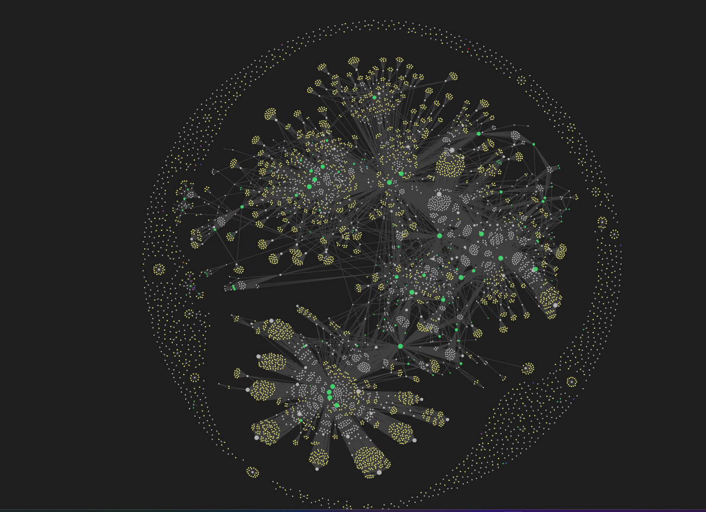
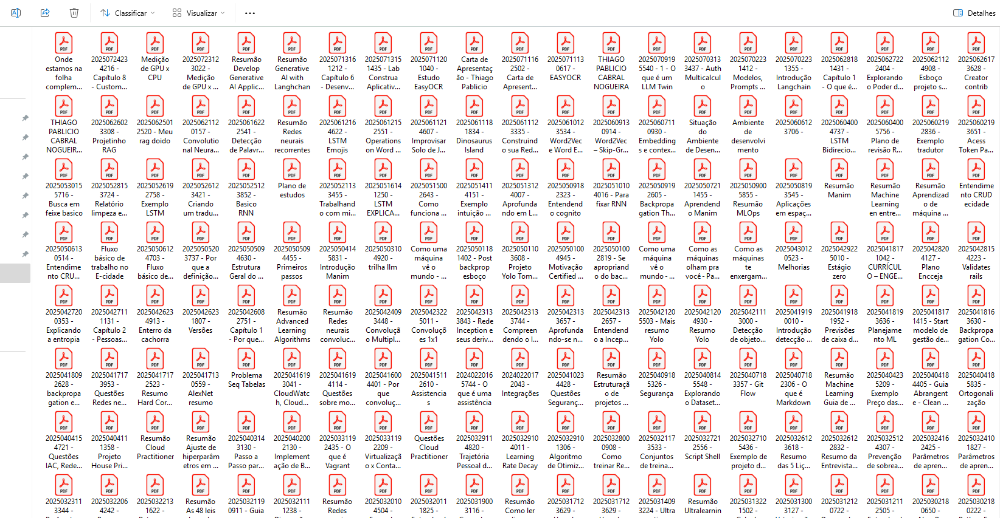

# 🧠 My Mind

## 🤖 LLM-Powered PDF & Notes ETL Pipeline (Python)

<table>
  <tr>
    <td style="vertical-align: top; padding-right: 20px; width: 50%">

<strong>My Mind</strong> is a <strong>modular ETL pipeline</strong> and <strong>personal knowledge assistant</strong> designed to transform your entire information ecosystem into a <strong>searchable, LLM-augmented brain</strong>.

It <strong>ingests diverse sources</strong> such as <strong>PDFs (digital and scanned), DOCX files, Excel sheets, Notion exports, Obsidian vaults</strong>, and <strong>book summaries</strong>, then unifies them into <strong>clean, structured Markdown notes</strong>. These notes feed a <strong>Retrieval-Augmented Generation (RAG)</strong> pipeline, allowing an LLM to answer questions using <em>your own knowledge</em> as context — like a <strong>digital twin of your memory</strong>.

<h4>🧠 Key use cases:</h4>
<ul>
  <li><strong>Ask questions</strong> about past notes, books, and documents</li>
  <li><strong>Navigate your Obsidian vault</strong> using natural language</li>
  <li><strong>Recall insights</strong> from PDFs and summaries you've read</li>
  <li><strong>Centralize fragmented knowledge</strong> across multiple tools</li>
  <li><strong>Build a second brain</strong> with <em>long-term memory and reasoning</em></li>
</ul>

Whether you're a <strong>researcher, writer, student, or knowledge worker</strong>, <strong>My Mind</strong> helps turn your scattered files into a <strong>cohesive, intelligent assistant</strong> — a <strong>searchable, contextualized reflection of how you think</strong>.
    </td>
    <td style="vertical-align: top; width: 50%">
      
      
    </td>
  </tr>
</table>


---
## 🎯 Key Features

* ✅ Supports both **scanned** and **text-based PDFs**
* ✅ OCR powered by **EasyOCR** with GPU fallback
* ✅ Converts PDFs to images via **pdf2image**
* ✅ Intelligent file loader: detects OCR vs structured extraction
* ✅ Modular ETL folders: `extract/`, `transform/`, `load/`, `utils/`
* ✅ Saves cleaned, structured Markdown files with metadata
* ✅ Optional embedding pipeline using **LangChain + LLMs**
* ✅ Robust logging and error handling (PDF-by-PDF)
* ✅ Automatic cleanup of temporary files

---

## 🏗️ Project Structure

```
project_root/
├── etl/                         # ETL pipeline: extract, transform, load
│   ├── extract/                 # File detection, OCR, and loading logic
│   │   ├── loader_files.py      # Loads structured documents (Text, Docx, Epub, etc.)
│   │   ├── ocr_files.py         # OCR pipeline for images and scanned PDFs
│   │   └── smart_loader.py      # Main controller: decides between loader vs OCR
│   │
│   ├── transform/               # Text preprocessing steps
│   │   ├── text_cleaner.py      # Cleans newlines, symbols, whitespace
│   │   └── text_splitter.py     # Splits long texts into manageable chunks
│   │
│   ├── load/                    # Output persistence and vectorization
│   │   ├── vector_reader.py     # Semantic search utilities
│   │   ├── vector_writer.py     # Optional embeddings for vector DB (FAISS, Chroma)
│   │
│   └── run_etl.py               # Main ETL runner script
│
├── data/                        # Storage for all data stages
│   ├── raw/                     # Input documents (PDFs, images, etc.)
│   ├── processed/               # Cleaned and intermediate text
│   └── output/                  # Final outputs: `.md`, `.json`, embeddings, etc.
│
├── training/                    # Optional fine-tuning support
│   ├── dataset_preparation.py   # Converts extracted data into model-ready datasets
│   ├── train.py                 # Fine-tunes models (e.g., LLaMA, GPT)
│   └── checkpoints/             # Saved model weights
│
├── inference/                   # RAG-ready inference and serving
│   ├── llms/                    # Supports multiple LLMs
│   ├── rag_pipeline.py          # Query + retrieval + generation logic
│   └── cli_app.py               # CLI or web interface (Streamlit/FastAPI)
│
├── utils/                       # Reusable helper utilities
│   ├── logging_utils.py         # Custom logging helpers
│   ├── directory.py             # Directory management helpers
│   ├── metrics.py               # Metrics calculation and evaluation
│   └── sanitizers.py            # Data sanitization utilities
│
├── config/                      # Pipeline configuration
│   ├── settings.py              # Centralized pipeline settings
│   ├── pipeline_paths.yml       # Input/output paths for all steps
│   └── .env.example             # Example secrets and API keys
│
├── notebooks/                   # Jupyter notebooks for experiments
│   └── ocr_eval.ipynb           # OCR evaluation experiments
│
├── requirements.txt             # Python dependencies
├── README.md                    # Project overview and instructions
└── run.py                       # Entry point for full pipeline execution
```

---

## ⚙️ Getting Started

### 1. Install dependencies

```bash
git clone https://github.com/pablicio/my-mind.git
cd my-mind
pip install -r requirements.txt
```

## 🔁 Pipeline Overview

### 📥 Extraction (`etl/extract/`)

* Uses EasyOCR to extract text from scanned images or PDFs
* Auto-selects loader based on file type
* PDF scanned vs structured is detected dynamically
* Text files (.txt, .docx, .epub) use LangChain-compatible loaders

### 🧹 Transformation (`etl/transform/`)

* Cleans and normalizes extracted text
* Optionally splits into chunks for embedding

### 📤 Load (`etl/load/`)

* Saves Markdown (`.md`) files with YAML frontmatter
* Optionally embeds content into FAISS or Chroma vector stores

Example Markdown output:

```markdown
---
source: example.pdf
pages: 4
processed: 2025-07-22
---

## Page 1
(Text here...)

## Page 2
(Next page...)
```

---

## 🧪 Run the Pipeline

```bash
python run.py --run-extraction-exec --run-transformation-exec --run-embedding-generation-exec --run-chunk-metrics-exec --run-embedding-metrics-exec --run-inference-exec --export-settings
```

Each file will be:

1. Checked for OCR or loader-based extraction
2. Converted (if needed) to image
3. Processed and cleaned
4. Saved as `.md` (optionally embedded)

---

## 🔍 Use Cases

* 📖 Knowledge assistants over personal PDFs
* 🔎 Semantic search for enterprise documents
* 🧘‍♀️ Life-logging and memory augmentation
* 🧾 Legal, financial, academic file indexing
* 💬 Natural-language document Q\&A

---

## 🛣️ Roadmap (Phase by Phase)

### ✅ Phase 1 – Document Ingestion (Completed)

* [x] Smart loader logic: decides between structured text extraction or OCR
* [x] OCR pipeline for scanned PDFs and images using EasyOCR
* [x] Loader for structured formats (.txt, .docx, .epub, etc.)

---

### ✅ Phase 2 – Text Transformation

* [x] `text_cleaner.py`: Normalize text (whitespace, symbols, line breaks)
* [x] `text_splitter.py`: Split cleaned text into semantic chunks

---

### ✅ Phase 3 – Output and Storage

* [x] `vector_reader.py`: Loading a previously saved vector database and performing semantic searches
* [x] `vector_writer.py`: Optional embedding generation (FAISS, Chroma, etc.)

---

### ✅ Phase 4 – Inference & Retrieval
* [x] `run.py`: Call pipelines by CLI
* [x] `rag_pipeline.py`: Combine retrieval + LLM generation (RAG)
* [x] `cli_app.py`: Build a simple CLI app
* [x] `chat_app.py`: Build a Streamlit or FastAPI interface

---

### 🧪 Phase 5 – Testing & Evaluation

* [ ] Add unit/integration tests for each ETL stage
* [x] Performance benchmarking (OCR speed, chunk quality, embedding quality, etc.)

---

### ⚙️ Phase 6 – Utilities and Config

* [ ] Logging and error reporting (`logging_utils.py`)
* [ ] Configuration management (`config_loader.py`, `.env`)
* [ ] File and path handling (`file_utils.py`)
* [ ] Metadata tagging and filtering logic (`sanitizers.py`)

---

### 🧠 Phase 7 – Training (Optional)

* [ ] `dataset_preparation.py`: Convert markdown/text chunks into fine-tuning format
* [ ] `train.py`: Finetune LLMs using curated datasets
* [ ] `checkpoints/`: Save model checkpoints

---

### 🌐 Phase 8 – UI and Integrations

* [ ] Streamlit Web UI
* [ ] File drag-and-drop upload (PDF, image, audio)
* [ ] Display OCR'd or extracted text
* [ ] Obsidian vault export for markdown outputs
* [ ] Markdown preview of final .md output

---

## 📄 License

MIT License — free for personal and commercial use.

---

## 🤝 Contributing

PRs are welcome! For feature requests or improvements, feel free to open an issue.

---

## 👋 Author

Made with ❤️ by \[Thiago Pablicio]
📧 Email: [pabliciotjg@gmail.com)](mailto:pabliciotjg@gmail.com)
🔗 GitHub: [github.com/pablicio](https://github.com/pablicio)
🔗 LinkedIn: [Thiago Pablicio](https://www.linkedin.com/in/thiago-pablicio-86357446/)

